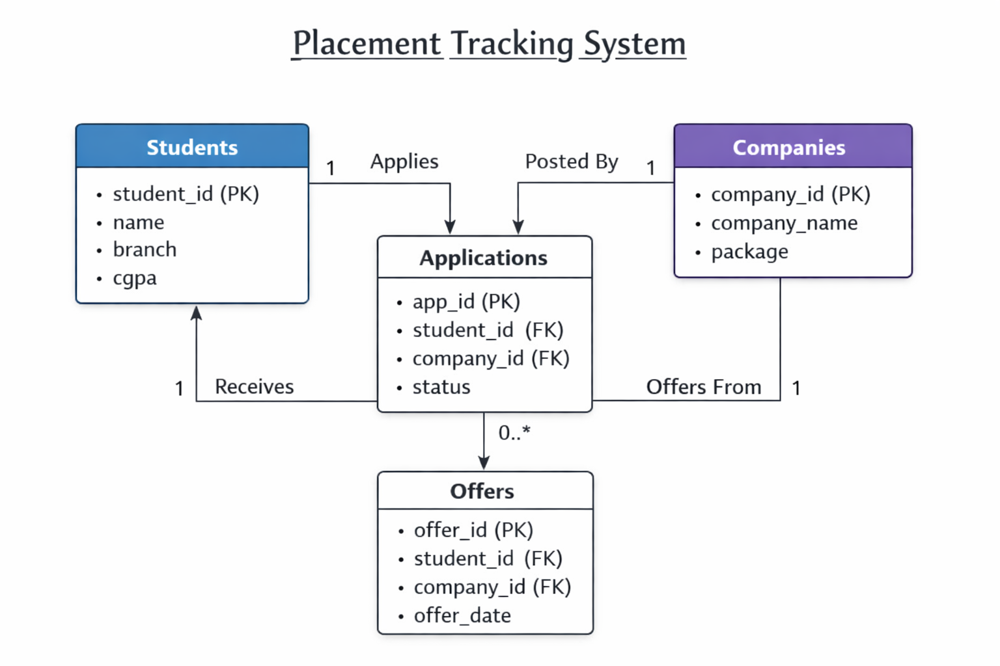

# 🎯 Placement Tracker System (SQL Project)

## 🚀 Overview

A **Placement Tracker System** built using SQL to manage and analyze student placement data.
This project focuses on handling **students, companies, job applications, and offers** while performing analytical queries to extract meaningful insights.

---

## 🧩 Features

* 📌 Track student applications and placement status
* 📊 Analyze placement statistics
* 🧠 Identify top-performing students
* 💼 Monitor company hiring trends

---

## 🧱 Database Schema

### 📂 Tables Used

* **Students** → Stores student details (name, branch, CGPA)
* **Companies** → Stores company details (name, package)
* **Applications** → Tracks application status (Applied, Selected, Rejected)
* **Offers** → Stores final job offers

---

## 🛠️ Tech Stack

* 🗄️ SQL (MySQL)
* 💻 Database Design
* 📁 Version Control using GitHub

---

## 🔍 Key SQL Queries

### 📌 Students who got placed

```sql
SELECT DISTINCT s.name
FROM Students s
JOIN Offers o ON s.student_id = o.student_id;
```

### 📌 Students not placed

```sql
SELECT name
FROM Students
WHERE student_id NOT IN (
    SELECT student_id FROM Offers
);
```

### 📌 Highest package company

```sql
SELECT company_name, package
FROM Companies
ORDER BY package DESC
LIMIT 1;
```

### 📌 Selection rate per company

```sql
SELECT c.company_name,
COUNT(CASE WHEN a.status = 'Selected' THEN 1 END) * 100.0 / COUNT(*) AS selection_rate
FROM Companies c
JOIN Applications a ON c.company_id = a.company_id
GROUP BY c.company_name;
```

---

## 📁 Project Structure

```
Placement-Tracker-SQL/
│
├── schema.sql
├── data.sql
├── queries.sql
├── README.md
```
## 📊 ER Diagram

---

## ▶️ How to Run

1. Install MySQL and open SQL editor
2. Run `schema.sql` to create tables
3. Run `data.sql` to insert data
4. Execute queries from `queries.sql`

---

## 💡 Key Concepts Used

* Joins (INNER, LEFT)
* Aggregation (SUM, COUNT, AVG)
* GROUP BY & HAVING
* Subqueries
* Relational database design

---

## 🎯 Use Case

This system helps:

* Track student placement progress
* Analyze company performance
* Evaluate hiring trends

---

## 🧠 What I Learned

* Designing normalized database schemas
* Writing optimized SQL queries
* Solving real-world data problems

---

## ⭐ Show Your Support

If you found this project helpful, consider giving it a ⭐ on GitHub!
